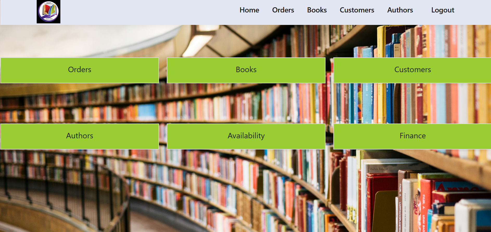
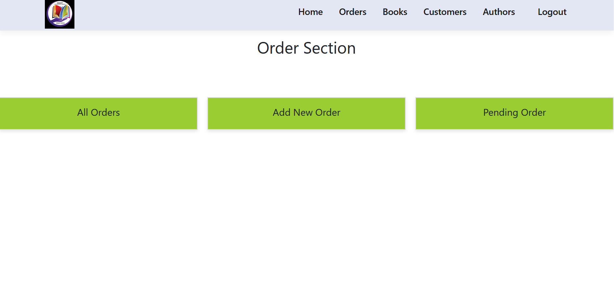
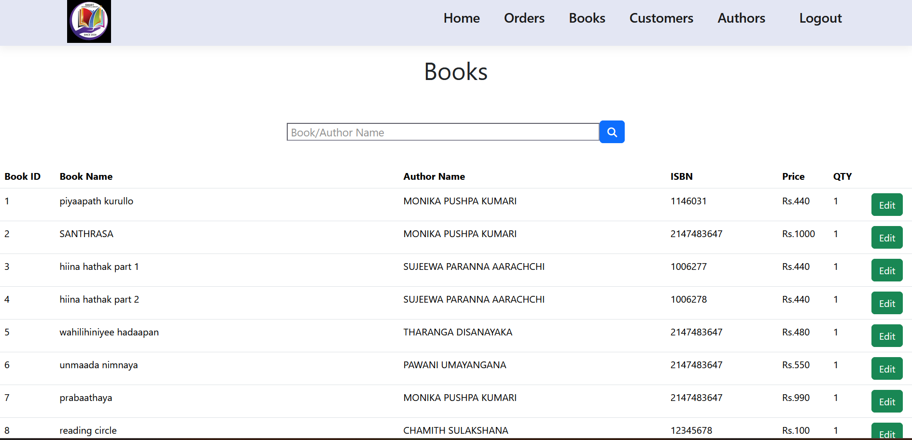
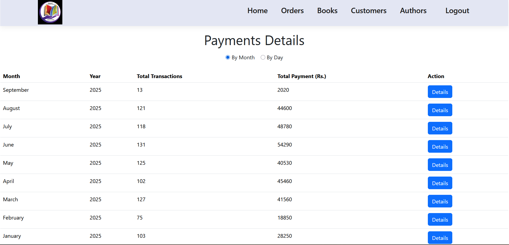
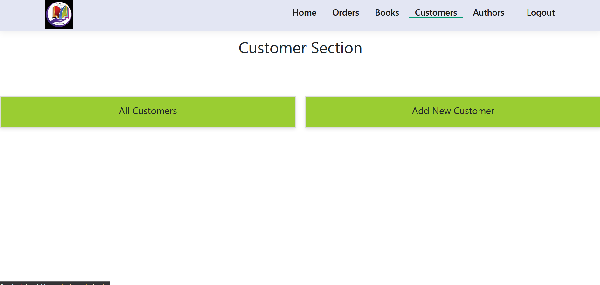
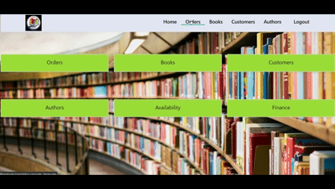

# 📚 Online Bookshop Management System

A **real-life Online Bookshop Management System** developed with **pure PHP, MySQL, JavaScript, CSS, and Bootstrap**.  
This system was created for a **bookshop owner** to manage **book loans with weekly fees**, track orders, and calculate daily income — all hosted on **InfinityFree** for cost-free deployment.  

---

## ✨ Features

- 📖 **Book Management** → Add, edit, and remove books  
- 🛒 **Order Placement** → Loan books with weekly fees  
- 📅 **Order Tracking** → Manage active and completed book loans  
- 💰 **Income Tracking** → Calculate daily and weekly income  
- 👨‍💻 **Admin Dashboard** → Centralized control panel for bookshop owner  
- 🌐 **Free Hosting** → Deployed on InfinityFree (no hosting costs)  

---

## 📂 Modules

- **Books Module** → CRUD operations for book catalog  
- **Orders Module** → Place & manage book loan orders  
- **Reports Module** → Daily/weekly income tracking  
- **Admin Panel** → Manage entire workflow  

---

## 📷 Screenshots

  
  
  
  
  

---

# 🎥 Demo Video

---

## 🧱 Tech Stack

- **Backend:** PHP 8.0  
- **Frontend:** HTML, CSS, JavaScript, Bootstrap 5  
- **Database:** MySQL  
- **Hosting:** InfinityFree (Free PHP Hosting)  

---

## 📌 Project Status
This project was **developed and successfully sold** to a client.  

## ✍️ Author
**Induwara Dissanayake**  
📧 Email: sahasrainduwara35@gmail.com  
🌐 Portfolio: [portfolio-induwara.vercel.app](https://portfolio-induwara.vercel.app/)  
